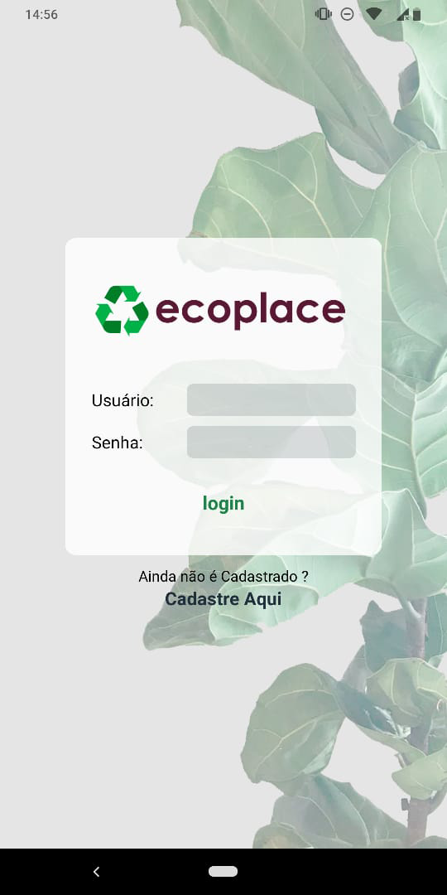
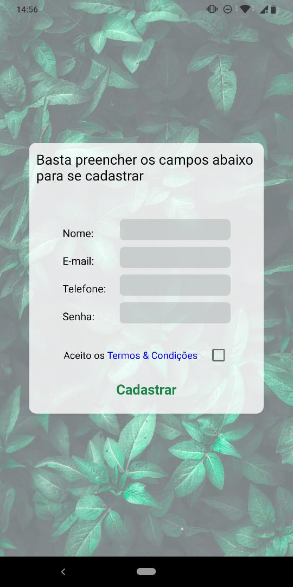

# ecoplace

## Sobre o projeto

- Projeto desenvolvido com o proposito de ser utilizado como um trabalho de conclusão de curso, a proposta era desenvolver uma plataforma que possibilitasse o descarte consciente de oleo através de solicitações realizadas pelo aplicativo

### Importante Mencionar
- O projeto foi finalizado, mas perdido durante uma falha eletrica em minha maquina. Sendo assim, essa  aultima versão do codigo que tenho disponivel esta incompleta, e em breve, quando eu for realizar a troca das API's utilizando Node.js, trarei os novos updates

## Composição

- React Native
- Npm Modules
- API's de conexão feitas em php
- MySQL

## Resultado apresentado

|   |   |   |   |
|---|---|---|---|
|   |   |   |   |  
